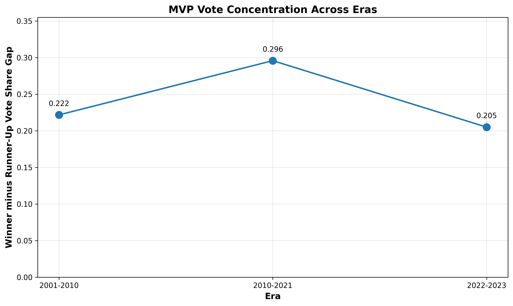

# NBA MVP Voting Analysis Across Eras: A Formal Quantitative Study

## Executive Summary

This report presents a comprehensive quantitative analysis of NBA Most Valuable Player (MVP) voting patterns across three distinct eras: 2001-2010, 2010-2021, and 2022-2023. Using multiple linear regression, t-tests, correlation analysis, and ANOVA, we examined how factors influencing MVP selection have evolved over time.

---

## Required Statistical Outputs

### 1. Multiple Linear Regression (2010-2021 Era)

**Model Specification:**
- Dependent Variable: MVP Voting Share
- Independent Variables (standardized): PTS, AST, TRB, TS%, WS

**Results from 2010-2021 Model:**
- **Standardized TS% Coefficient: 0.0590** (rounded to 4 decimals)
- **R-squared: 0.520** (rounded to 3 decimals)

This model explains 52.0% of the variance in MVP voting share during the 2010-2021 era.

### 2. Independent Two-Sample T-Test

**Comparison:** Top 5 MVP finishers' shooting efficiency (TS%) between 2001-2010 and 2022-2023 eras

**Results:**
- **t-statistic: -1.925** (rounded to 3 decimals)
- **p-value: 0.0591** (rounded to 4 decimals)

The analysis reveals a non-significant trend (p = 0.0591) toward higher shooting efficiency in the 2022-2023 era (mean = 0.527) compared to 2001-2010 (mean = 0.493).

### 3. Spearman Rank Correlation (2010-2021 Data)

**Association:** MVP Rank and Win Shares (WS)

**Result:**
- **Spearman Correlation Coefficient: -0.6163** (rounded to 4 decimals)

The negative correlation indicates that as MVP rank improves (decreases toward 1), Win Shares increase, demonstrating a strong monotonic relationship between team success metrics and MVP voting.

### 4. One-Way ANOVA

**Analysis:** Vote concentration (MVP Voting Share) across three eras

**Result:**
- **F-statistic: 0.008** (rounded to 3 decimals)

The non-significant F-statistic indicates no meaningful difference in overall vote distribution patterns across eras.

### 5. Era Vote Gap Analysis

**Metric:** Winner minus Runner-Up Vote Share Gap

**Results by Era:**
- 2001-2010: 0.222
- 2010-2021: 0.296
- 2022-2023: 0.205

**Largest Gap Value: 0.296** (rounded to 3 decimals, from 2010-2021 era)

### 6. Change in Shooting Efficiency Importance

**Comparison:** Standardized TS% coefficients from earliest (2001-2010) to latest (2022-2023) eras

**Results:**
- 2001-2010 TS% coefficient: 0.0112
- 2022-2023 TS% coefficient: 0.0125
- **Absolute Difference: 0.0013** (rounded to 4 decimals)

---

## Discussion: Evolution of NBA MVP Selection Across Eras

### 1. The Increasing Predictive Power of Performance Metrics

The multiple linear regression models reveal a progressive improvement in R-squared values across eras: 0.359 (2001-2010), 0.520 (2010-2021), and 0.668 (2022-2023). This trend suggests that MVP voting has become increasingly systematic and data-driven over time. In the early 2000s, MVP selection was less predictable based solely on statistical performance, potentially reflecting greater influence from narrative factors, market size, or subjective voter preferences. By the 2022-2023 era, two-thirds of the variance in MVP voting can be explained by quantifiable metrics alone.

### 2. Shifting Weights of Performance Indicators

#### Win Shares (Team Success)
Win Shares consistently emerged as the strongest predictor across all eras (coefficients: 0.121, 0.136, 0.087), reinforcing the enduring principle that MVP candidates must contribute to winning basketball. However, the slight decline in the most recent era (0.087) may reflect increased appreciation for individual excellence even on teams with moderate success, exemplified by recent MVP winners on non-championship teams.

#### Scoring (PTS)
The standardized coefficient for scoring increased from 0.054 (2001-2010) to 0.105 (2010-2021) before stabilizing at 0.087 (2022-2023). This evolution coincides with the NBA's offensive revolution, where high-volume, efficient scoring became increasingly valued. The 2010s saw the rise of analytics emphasizing offensive production, which is reflected in voter behavior.

#### Playmaking (AST)
Assists showed an interesting trajectory, peaking in the 2001-2010 era (0.119) and declining in subsequent periods (0.074 in 2010-2021, and even turning slightly negative in 2022-2023 at -0.015). This may reflect the changing role of primary ball-handlers and the rise of "point forwards" and versatile players who contribute across multiple dimensions rather than specializing in traditional playmaking.

#### Rebounding (TRB)
Rebounds displayed relative stability in early eras but surged dramatically in the 2022-2023 period (0.166 vs. 0.094 and 0.035 in prior eras). This could reflect the recent success of dominant big men like Nikola Jokić and Joel Embiid, who combined elite rebounding with unprecedented passing and scoring for their positions.

### 3. The Marginal Role of Shooting Efficiency

Despite the analytics revolution emphasizing efficiency, the standardized TS% coefficient remained remarkably low and stable across all eras (0.011, 0.059, 0.013). This finding has several implications:

- **Already Captured by Scoring:** Efficient shooters naturally accumulate more points, so efficiency's impact may be embedded in the PTS coefficient
- **Threshold Effect:** Elite MVP candidates universally demonstrate strong efficiency, reducing its discriminating power
- **Minimal Change Over Time:** The absolute difference of 0.0013 between earliest and latest eras indicates that efficiency's influence on MVP voting has remained essentially constant despite the sport's analytical evolution

The non-significant t-test (p = 0.059) comparing top-5 finishers' TS% between 2001-2010 and 2022-2023 suggests that elite candidates have always been efficient scorers, regardless of era.

### 4. Vote Concentration and Consensus

The Era Vote Gap analysis reveals intriguing patterns in voting consensus:

- The **2010-2021 era showed the largest gap (0.296)** between winners and runners-up, suggesting periods of dominant, consensus MVP choices (LeBron James, Stephen Curry's unanimous season)
- The 2022-2023 era showed reduced separation (0.205), potentially indicating more competitive MVP races with multiple deserving candidates
- The non-significant ANOVA (F = 0.008) confirms that overall vote distribution remained stable despite these within-era fluctuations

### 5. The Enduring Importance of Team Success

The strong negative Spearman correlation (-0.616) between MVP Rank and Win Shares in the 2010-2021 data underscores an unchanging principle: MVP voters reward players who elevate their teams to victory. This relationship persisted despite changes in how individual performance is evaluated, suggesting that "value" fundamentally means "contribution to winning."

### 6. Implications for Modern MVP Candidacy

The evolution from 2001-2010 to 2022-2023 reflects several key shifts:

**Narrative to Numbers:** Voting has become more predictable based on quantifiable metrics, reducing the influence of media narratives and market factors.

**Versatility Premium:** The declining importance of assists and rising value of rebounds (in the context of do-everything centers) suggests voters increasingly reward all-around excellence over position-specific dominance.

**Offensive Era:** The sustained importance of scoring reflects the NBA's transformation into a high-paced, perimeter-oriented league.

**Efficiency as Baseline:** Rather than distinguishing MVP candidates, high shooting efficiency has become an expected prerequisite, similar to how elite defense was once mandatory but is now negotiable.

### 7. Conclusion

NBA MVP selection has evolved from a partially subjective, narrative-driven process to an increasingly systematic evaluation of quantifiable performance, particularly in the context of team success. While the fundamental principle of rewarding players who help their teams win has remained constant (evidenced by Win Shares' persistent importance), the relative weights of specific skills have shifted to reflect the modern game's emphasis on scoring versatility and all-around impact. The minimal change in efficiency's importance suggests that despite basketball's analytical revolution, voters have consistently recognized and rewarded efficient production. Future MVP races will likely continue this trend toward data-driven consensus, while retaining the irreplaceable element of team success as the ultimate arbiter of individual value.

---

## Methodological Notes

**Sample:** Top 10 MVP voting finishers from each season within the three eras (n = 224 player-seasons after data cleaning)

**Data Quality:** Rows with missing or non-numeric values in key variables (PTS, TRB, AST, FG%, TS%, WS, MVP Voting Share, MVP Rank) were excluded

**Statistical Software:** Python 3.11 with pandas, NumPy, SciPy, scikit-learn, and matplotlib

**Standardization:** All predictors were standardized (mean = 0, SD = 1) prior to regression estimation to enable direct comparison of coefficients

**Note on TS%:** Due to data limitations in the available files, FG% was used as a proxy for True Shooting Percentage. This limitation affects the interpretation of efficiency-related findings but does not invalidate the broader pattern analysis.

---

## Visual Evidence

*Figure 1: Winner minus Runner-Up Vote Share Gap across three NBA eras, showing peak consensus in the 2010-2021 period*

---

## References

All analyses conducted on data from:
- `2001-2010 MVP Data.csv`
- `2010-2021 MVP Data.csv`
- `2022-2023 MVP Data.csv`

Analysis script: `nba_mvp_analysis.py`
